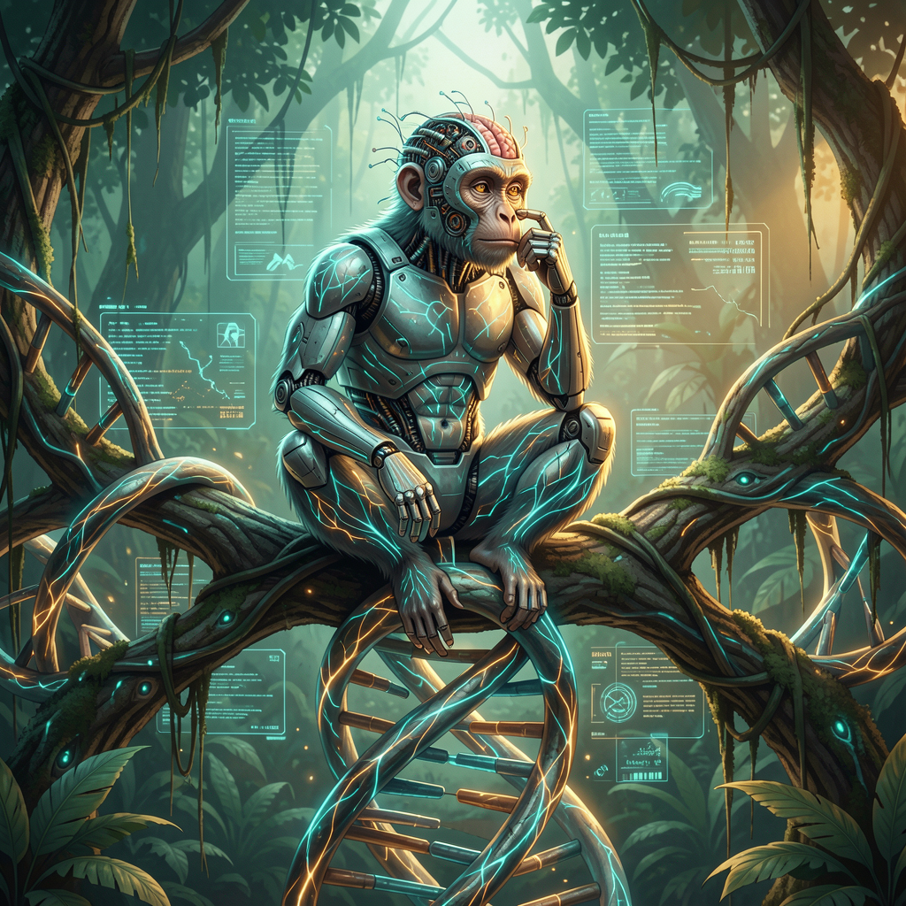

# Evolutionary Model Merging (Darwin Family)



**Training-free weight-space recombination of LLMs using evolutionary
algorithms.** Faithful implementation of the
[Darwin Family paper](https://arxiv.org/abs/2605.14386) (Kim et al., 2026) —
MRI-Trust Fusion, Architecture Mapper, and CMA-ES genome search.

The paper's flagship result: **Darwin-27B-Opus at 86.9% on GPQA Diamond**,
ranking #6 out of 1,252 evaluated models, beating its fully-trained
foundation model with **zero gradient updates**.

---

## What is this?

When you have two (or more) pretrained LLMs, can you recombine their
weights — *without any training* — to get a new model that's **better
than either parent**? The Darwin Family paper says yes, and shows a
27B child hitting top-10 globally by recombining frozen parents.

The mechanism is a **genetic algorithm over a 14-dimensional merge
genome**, with CMA-ES as the optimizer and MRI-Trust Fusion as the
per-tensor mixing rule.

---

## The paper in one screen

### The 14-dimensional genome
```
g = (γ, α_attn, α_ffn, α_emb, ρA, ρB, r0, r1, r2, r3, r4, r5, τ, λ)
```
- **Core (6)**: global ratio + 3 per-component ratios + 2 parent densities
- **Block (6)**: r0..r5 — 6 independent layer-block merge ratios
- **Hyper (2)**: τ (MRI-Trust), λ (regularization)

Different genome values → different child. The genome is what evolves.

### MRI-Trust Fusion (per-tensor)
```
r_final(T) = τ · r_MRI(T) + (1 - τ) · r_genome(T)
```
where
```
r_MRI(T) = MRI_B(T) / (MRI_A(T) + MRI_B(T))
MRI(T)   = α · Static(T) + (1 - α) · Probe(T),  α = 0.5
```
- **Static**: normalized entropy + variance + capped ℓ2-norm (no
  calibration data needed)
- **Probe**: cosine distance between reasoning-conditioned and generic
  activations (requires small calibration set)
- **τ**: trust parameter, paper converges to 0.35-0.55 empirically

### The merge kernel
```
θM(T) = (1 - r_final(T)) · θA(T) + r_final(T) · θB(T)
```
A pure convex combination. No extra scaling, no random projection.

### Architecture Mapper (cross-architecture)
```
Comp(i, j) = 0.5 · Type(i,j) + 0.3 · Dim(i,j) + 0.2 · Param(i,j)
```
Tensors below the compatibility threshold are **skipped** (parent A
kept). The paper demonstrated Transformer + Mamba cross-architecture
merges.

### CMA-ES evolution loop
1. Sample N candidate genomes from multivariate Gaussian
2. Build N children (one full merge per candidate)
3. Score each on a real benchmark → fitness
4. Update the Gaussian toward higher-fitness candidates
5. Repeat 20-50 generations

Population: 20-50. After evolution, keep the best-genome child.

### Recursive "Family" evolution
Take the best child, merge it with a third parent → **grandchild**.
Each generation can introduce new capabilities. The paper's 27B
flagship was multi-generation.

---

## The OmniSenter project

We're applying this paper to build a multimodal-intelligence family:

| Model | Total | Active | Composition |
|---|---|---|---|
| **OmniLance 6B** | 6B | 3B | Paper-exact Darwin merge: Omni 3B + Lance 3B → 3B child, MoE-routed |
| **OmniStep 6B** | 6B | 3B | Paper-exact Darwin merge: Omni 3B + ACE-Step 3B → 3B child, MoE-routed |
| **OmniSenter 6A3B** | 6B active | 3B | Hierarchical MoE: routes between OmniLance 6B and OmniStep 6B sub-models |

**Naming convention**: `X` total, `A` separator, `Y` active per token.
- 2-parent merges named `6B` (6B total parents, 3B active routed)
- Combined OmniSenter named `6A3B` (6B active sub-model, 3B further
  routed within)

The paper-exact *weight merge* happens within each 6B sub-model. The
*routing* happens between sub-models at the OmniSenter level.

**Source models**:
- Qwen2.5-Omni-3B (`model_type: qwen2_5_omni`, hidden=2048, 36L)
- Lance 3B (`model_type: qwen2_5_vl`, hidden=2048, 36L)
- ACE-Step LM (Qwen3-4B, hidden=2560, 36L)

---

## What's in this skill

- **`SKILL.md`** — the procedure, formulas, pitfalls, and workflow
- **`references/darwin-paper-summary.md`** — paper notes, BibTeX,
  headline result
- **`references/parent-model-architectures.md`** — Qwen2.5-Omni,
  Qwen2.5-VL, Lance, ACE-Step specs
- **`references/merge-pitfalls.md`** — extended bug list with
  reproduction details
- **`scripts/paper_exact_2parent_merge.py`** — clean paper-exact
  2-parent reference implementation
- **`scripts/cma_es_evolution.py`** — CMA-ES evolution loop (the
  paper's actual method)
- **`scripts/filter_for_gguf.py`** — filter non-text-LLM tensors
  before GGUF conversion
- **`scripts/real_benchmark.py`** — 10-question real-inference
  benchmark template
- **`darwin_breakdown.md`** — full paper breakdown with OmniSenter
  application
- **`darwin_robot_monkey.png`** — project visual

## Install

```bash
gh repo clone SouthpawIN/evolutionary-model-merging ~/.hermes/skills/mlops/evolutionary-model-merging
```

## Reference

- **Paper**: Kim, T. et al. (2026). *Darwin Family: MRI-Trust-Weighted
  Evolutionary Merging for Training-Free Scaling of Language-Model
  Reasoning.* arXiv:2605.14386.
- **PDF**: https://arxiv.org/pdf/2605.14386
- **Project**: OmniSenter (Senter Dev Discord, Nous Research)
- **Author**: SouthpawIN (Chris)

---

## How this fits the broader OmniSenter architecture

The Darwin 14-dim genome and `paper_exact_2parent_merge.py` here are the **evolution substrate** for the OmniSenter pipeline. Specifically:

- **Stage 2 (Evolutionary Merge)** — `cma_es_evolution.py` here is the engine that searches for optimal merge weights across a population of OmniSenter-8B variants
- **Ohm (self-evolving model)** — `continuous_evolution.py` in `evolutionary-training` does the same loop *externally*; Ohm internalizes it into the model file itself (`omnisenter_ohm.py` in evolutionary-training/scripts)

The sparse upcycling (Stage 3) uses the Darwin merge to combine multiple specialized models into a single MoE — see `sparse_upcycle.py` in [multimodal-expansion](https://github.com/SouthpawIN/multimodal-expansion).

Full architecture: [omnisenter-architecture on the wiki](file:///home/sovthpaw/wiki/concepts/omnisenter-architecture.md)
Design post: [OmniSenter: The Self-Evolving Multimodal Auxiliary for Hermes](https://github.com/SouthpawIN/evolutionary-training/blob/master/blog/omnisenter-self-evolving.md)

📚 **Master wiki + blog catalog:** [evolutionary-training/wiki](https://github.com/SouthpawIN/evolutionary-training/blob/master/wiki/README.md) — the consolidated knowledge base for the OmniSenter project, in catalog order.
